# 1.1 – ReviewInsight AI sistemos projektavimas (PlantUML → Mermaid)

**ReviewInsight AI** – klientų atsiliepimų analizės sistema e. parduotuvei, naudojanti generatyvųjį dirbtinį intelektą (Google Gemini API).

Šioje dalyje su Claude pagalba sistema suprojektuota UML diagramomis: pirmiausia sukurtos 5 **PlantUML** diagramos, vėliau jos konvertuotos į **Mermaid** sintaksę, kurią GitHub atvaizduoja tiesiogiai.

> **Naudotas įrankis:** Claude (_Opus 5.5_)

## Turinys

1. [Užduoties formuluotė](#užduoties-formuluotė)
2. [Pirmas prompt'as – PlantUML](#pirmas-promptas--plantuml)
3. [Claude atsakymas – architektūros aprašas](#claude-atsakymas--architektūros-aprašas)
4. [PlantUML diagramos](#plantuml-diagramos)
5. [Antras prompt'as – Mermaid](#antras-promptas--mermaid)
6. [Mermaid diagramos](#mermaid-diagramos)

---

## Užduoties formuluotė

> Dviejų (arba vieno) studentų komanda pasirenka temą. Tos temos rėmuose turi būti sukurta informacinė sistema, kuri naudoja generatyvųjį dirbtinį intelektą.
> Parašomas prompt'as AI modeliui, kuriame paprašoma tokią sistemą sukurti pradžioje naudojant PlantUML diagramas, o po to – Mermaid.

---

## Pirmas prompt'as – PlantUML

````text
Tu esi patyręs programų sistemų architektas ir UML ekspertas. Padėk man suprojektuoti informacinę sistemą, kuri naudoja generatyvųjį dirbtinį intelektą.

SISTEMOS PAVADINIMAS: ReviewInsight AI – klientų atsiliepimų analizės sistema e. parduotuvei.

SISTEMOS TIKSLAS:
E. parduotuvė kasdien gauna daug klientų atsiliepimų apie prekes. Sistema turi automatiškai juos analizuoti naudodama generatyvųjį DI (Google Gemini API) ir padėti parduotuvės darbuotojams greičiau reaguoti į klientų problemas.

FUNKCINIAI REIKALAVIMAI:
1. Atsiliepimų priėmimas: vadybininkas įkelia iš e. parduotuvės platformos eksportuotą CSV/JSON failą su atsiliepimais (tekstas, įvertinimas 1–5, prekės ID, data).
2. Teksto paruošimas: valymas, kalbos nustatymas, per trumpų atsiliepimų atmetimas.
3. DI analizė per Gemini API, grąžinanti JSON: nuotaika su pasitikėjimo balu, problemų kategorijos, santrauka, skubumo lygis ir atsakymo klientui juodraštis.
4. Atsakymo validavimas: JSON struktūros patikrinimas, pakartotinė užklausa klaidos atveju.
5. Vadybininko peržiūra: DI atsakymo patvirtinimas, redagavimas arba atmetimas.
6. Suvestinės: nuotaikų ir problemų kategorijų pasiskirstymas.

AKTORIAI:
- Klientas (palieka atsiliepimą e. parduotuvėje ir gauna patvirtintą atsakymą; su sistema tiesiogiai nebendrauja);
- Parduotuvės vadybininkas (peržiūri analizę ir atsakymus);
- Administratorius (konfigūruoja sistemą, prompt'us, kategorijas);
- Išorinė sistema: Google Gemini API;
- Išorinė sistema: e. parduotuvės platforma (atsiliepimų šaltinis).

TECHNOLOGIJOS: Python, Gemini API (google-genai biblioteka), pandas, matplotlib, SQLite duomenų saugojimui, prototipas veikia Google Colab aplinkoje.

UŽDUOTIS:
Pirmiausia trumpai (iki 10 sakinių) aprašyk sistemos architektūrą. Tada sukurk šias PlantUML diagramas:
1. Užduočių diagrama (Use Case) – visi aktoriai ir jų panaudos atvejai, su <<include>> / <<extend>> ryšiais, kur tinka.
2. Komponentų (architektūros) diagrama – pagrindiniai sistemos moduliai ir jų ryšiai su išorinėmis sistemomis.
3. Klasių diagrama – pagrindinės klasės (pvz., Review, AnalysisResult, ReviewLoader, ReviewPreprocessor, GeminiAnalyzer, ResponseValidator, ReportGenerator) su atributais, metodais ir ryšiais.
4. Sekų diagrama (Sequence) – atsiliepimų apdorojimas nuo failo įkėlimo iki vadybininko patvirtinto atsakymo, įskaitant Gemini API iškvietimą ir klaidos atvejį (alt blokas).
5. Veiklos diagrama (Activity) – visas duomenų apdorojimo srautas su sprendimo taškais (pvz., ar atsiliepimas tinkamas, ar JSON validus).

REIKALAVIMAI ATSAKYMUI:
- Kiekviena diagrama atskirame kodo bloke, prasidedanti @startuml ir besibaigianti @enduml.
- Kiekviena diagrama turi turėti title.
- Sintaksė turi būti validi ir sugeneruojama per plantuml.com arba PlantText be klaidų.
- Po kiekviena diagrama – 2–3 sakinių paaiškinimas lietuvių kalba.
- Elementų pavadinimai diagramose – lietuvių kalba, klasių ir metodų pavadinimai – anglų kalba (kaip programiniame kode).
````

---

## Claude atsakymas – architektūros aprašas

ReviewInsight AI remiasi trijų sluoksnių architektūra, o jos centre yra duomenų apdorojimo konvejeris (angl. pipeline). Pateikimo sluoksnį sudaro Google Colab užrašinė su ipywidgets sąsajomis vadybininkui ir administratoriui. Taikymo sluoksnyje veikia orkestratorius ReviewPipeline, kuris paeiliui kviečia kelis modulius: failų įkėlimo (ReviewLoader, pandas), teksto paruošimo (ReviewPreprocessor), DI analizės (GeminiAnalyzer) ir atsakymų validavimo (ResponseValidator). GeminiAnalyzer jungiasi prie Gemini API per google-genai biblioteką. Užklausoje nurodomi response_mime_type="application/json" ir response_schema, todėl modelis grąžina struktūrizuotą JSON. Validatorius tikrina schemą ir reikšmių ribas. Jei atsakymas nevalidus arba įvyksta API klaida, užklausa kartojama su eksponentiniu laukimu (exponential backoff), bet ne daugiau kaip nustatytą kartų skaičių. Duomenų sluoksnį sudaro ReviewRepository ir SQLite duomenų bazė, kurioje saugomi atsiliepimai, analizės rezultatai, vadybininkų sprendimai ir versijuojami prompt'ų šablonai. Sistema veikia pagal human-in-the-loop principą: jokio DI atsakymo klientas negauna, kol jo nepatvirtina vadybininkas. ReportGenerator su pandas ir matplotlib kuria nuotaikų ir kategorijų suvestines, o patvirtinti atsakymai eksportuojami atgal į e. parduotuvės platformą.

---

## PlantUML diagramos

### 1. Užduočių (panaudos atvejų) diagrama

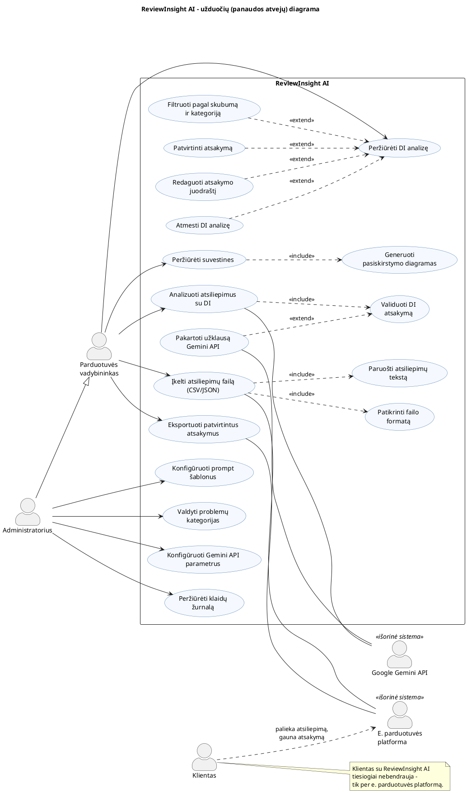


**Paaiškinimas:** Pagrindinis aktorius yra vadybininkas. Administratorius paveldi visas jo teises (generalizacija) ir papildomai konfigūruoja prompt'us, kategorijas bei API parametrus. `<<include>>` žymi privalomus žingsnius, pavyzdžiui, kiekviena DI analizė visada validuojama. `<<extend>>` žymi sąlyginius veiksmus: pakartotinė užklausa vyksta tik validacijai nepavykus, o patvirtinimas, redagavimas ir atmetimas yra alternatyvios peržiūros baigtys. Klientas pavaizduotas už sistemos ribų, nes su sistema jis sąveikauja tik netiesiogiai, per platformą.

### 2. Komponentų (architektūros) diagrama

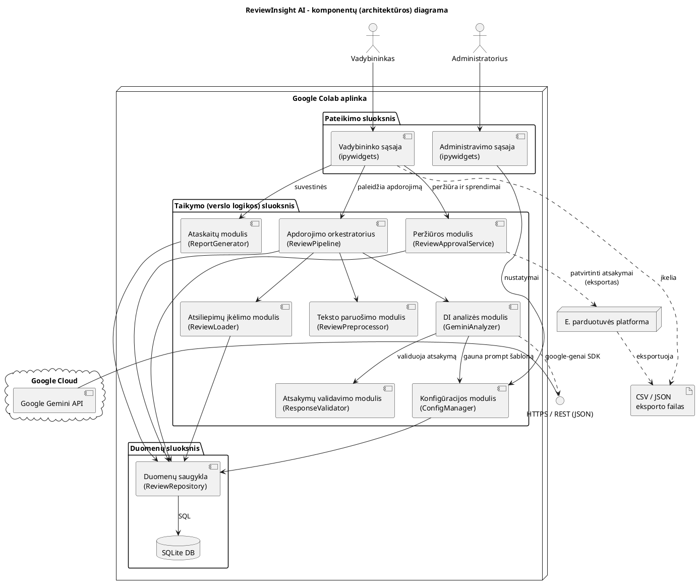

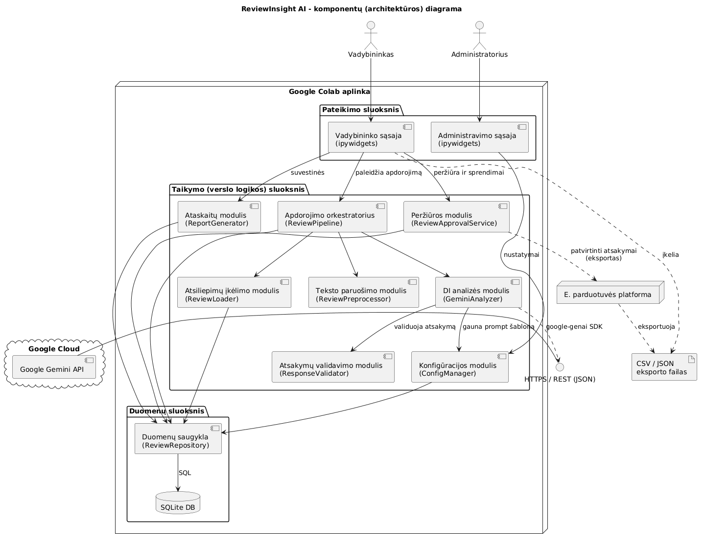

**Paaiškinimas:** Diagramoje matyti sluoksninė architektūra. Visi taikymo moduliai prie duomenų kreipiasi tik per ReviewRepository, todėl vėliau SQLite būtų galima pakeisti, pavyzdžiui, PostgreSQL, nekeičiant verslo logikos. Su Gemini API tiesiogiai bendrauja vienintelis modulis, GeminiAnalyzer, veikiantis kaip adapteris, tad keičiant DI tiekėją reikėtų keisti tik jį. Su e. parduotuvės platforma integruojamasi per failų eksportą ir importą, nes tai paprasčiausias ir prototipui tinkamiausias būdas.

### 3. Klasių diagrama

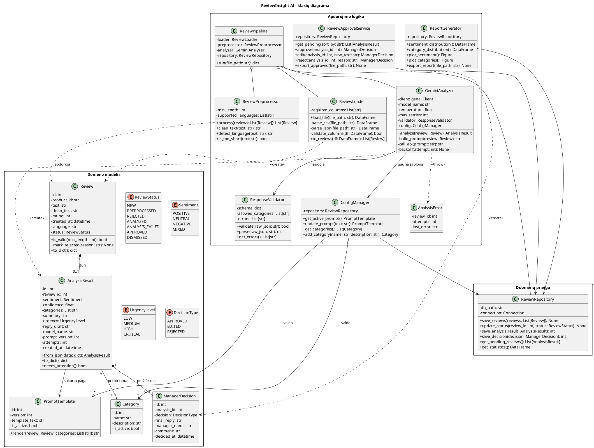

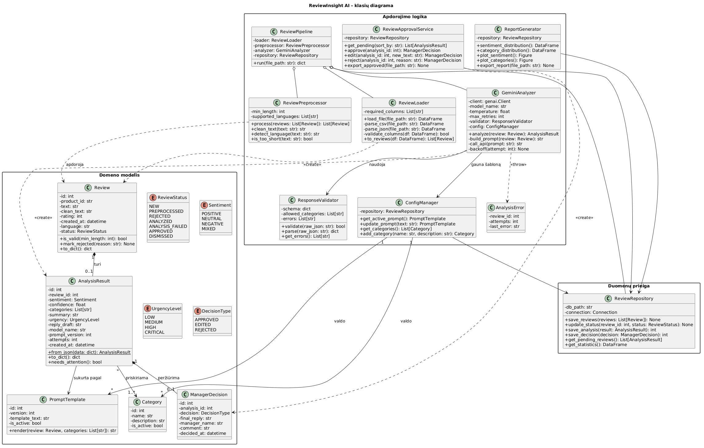

**Paaiškinimas:** Klasės suskirstytos į tris paketus: domeno modelį (duomenų objektai ir enum tipai), apdorojimo logiką (servisai) ir duomenų prieigą. Kompozicija Review → AnalysisResult → ManagerDecision atspindi atsiliepimo gyvavimo ciklą: analizė ir sprendimas be atsiliepimo neegzistuoja. AnalysisResult saugo model_name ir prompt_version, todėl visada galima atsekti, kuriuo modeliu ir kuria prompt'o versija buvo gautas rezultatas. Tai svarbu kokybės auditui.

### 4. Sekų diagrama

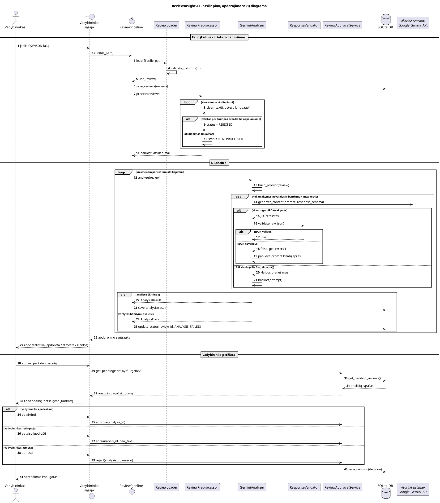

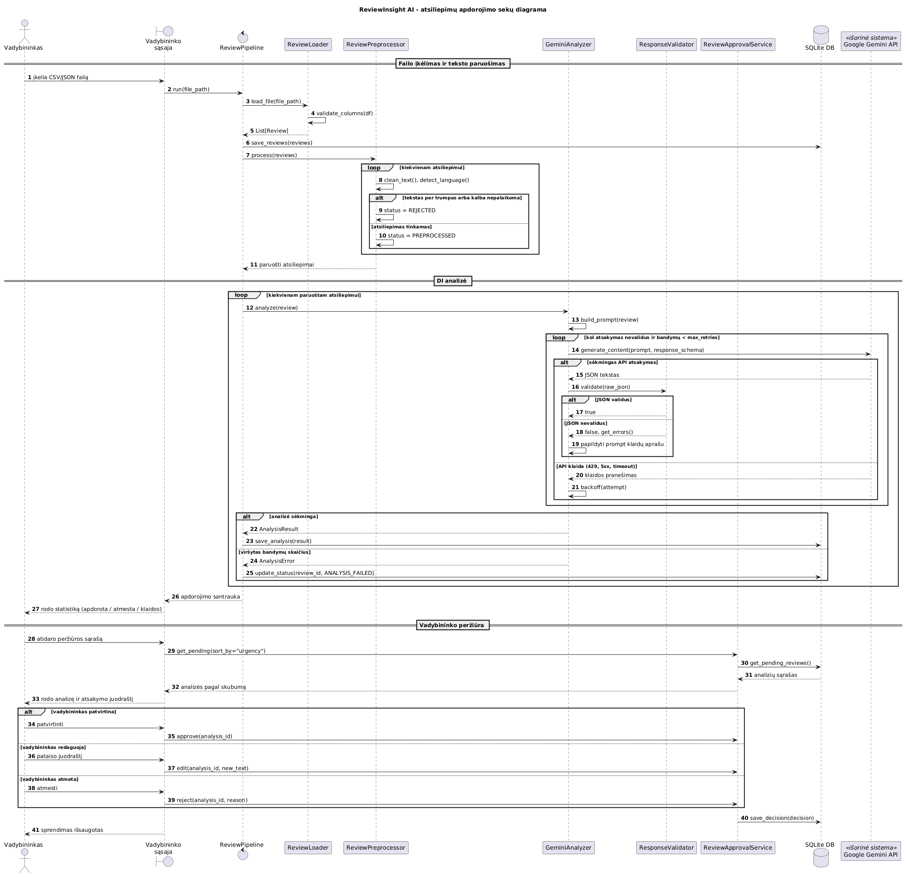

**Paaiškinimas:** Diagrama suskirstyta į tris fazes: įkėlimą ir paruošimą, DI analizę ir vadybininko peržiūrą. Vidinis loop su įdėtais alt blokais aprašo patikimumo mechanizmą. Kai JSON nevalidus, į prompt'ą įtraukiamas klaidų aprašas, kad modelis galėtų pasitaisyti. Kai įvyksta API klaida (pvz., 429 dėl užklausų limito), taikomas eksponentinis laukimas. Viršijus bandymų limitą, atsiliepimas pažymimas ANALYSIS_FAILED ir neblokuoja likusių atsiliepimų apdorojimo.

### 5. Veiklos diagrama

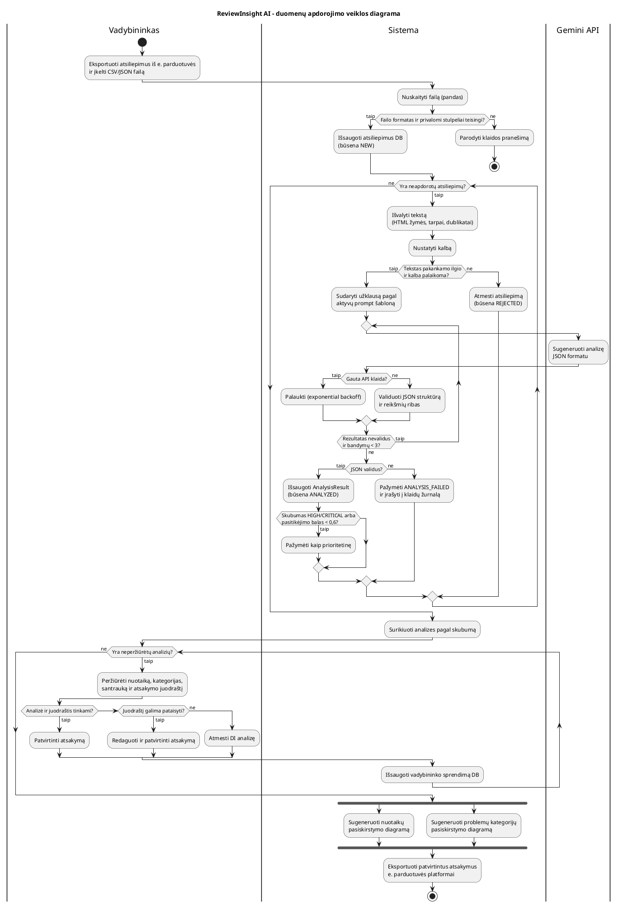

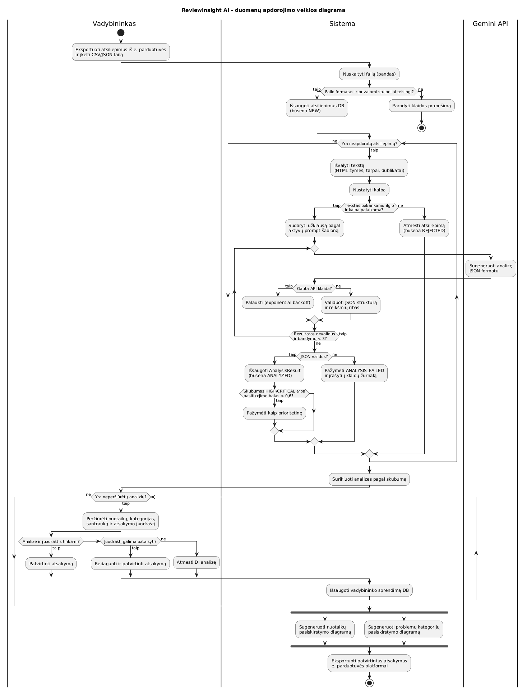

**Paaiškinimas:** Takeliai (swimlanes) parodo atsakomybių pasiskirstymą tarp vadybininko, sistemos ir išorinio Gemini API. Pagrindiniai sprendimo taškai yra failo formato tikrinimas, atsiliepimo tinkamumas (ilgis ir kalba) ir JSON validumas. Pastarasis įgyvendintas repeat while ciklu su trijų bandymų limitu. Papildomas prioriteto žymėjimas pagal skubumą ir žemą pasitikėjimo balą padeda vadybininkui pirmiausia reaguoti į svarbiausias problemas, o fork blokas parodo, kad abi suvestinės gali būti generuojamos lygiagrečiai.

---

## Antras prompt'as – Mermaid

````text
Dabar konvertuok visas 5 aukščiau sukurtas PlantUML diagramas į Mermaid sintaksę, išlaikydamas tą patį turinį, elementus, pavadinimus ir ryšius.

KONVERTAVIMO TAISYKLĖS:
1. Užduočių diagrama → flowchart LR. Mermaid neturi atskiro use case diagramos tipo, todėl:
- aktorius vaizduok kaip ((apskritimus)), išorines sistemas – kaip [[dvigubus stačiakampius]];
- panaudos atvejus vaizduok kaip ([suapvalintus mazgus]);
- sistemos ribas „ReviewInsight AI“ vaizduok kaip subgraph;
- <<include>> ir <<extend>> ryšius vaizduok punktyrinėmis rodyklėmis su tekstu, pvz. A -.->|"«include»"| B.
2. Komponentų diagrama → flowchart TB su subgraph blokais sistemos sluoksniams (pvz., duomenų įkėlimas, apdorojimas, DI analizė, saugojimas, ataskaitos) ir atskirais mazgais išorinėms sistemoms (Gemini API, e. parduotuvės platforma).
3. Klasių diagrama → classDiagram. Išlaikyk atributų ir metodų tipus, matomumą (+, -), ryšių tipus (asociacija, kompozicija, priklausomybė) ir kardinalumą.
4. Sekų diagrama → sequenceDiagram. Išlaikyk visus dalyvius, alt/else blokus klaidos atvejui, loop blokus (jei yra) ir aktyvacijas.
5. Veiklos diagrama → flowchart TD. Sprendimo taškus vaizduok kaip {rombus}, pradžią ir pabaigą kaip ((apskritimus)), o šakas žymėk tekstu ant rodyklių (pvz., |Taip| / |Ne|).

REIKALAVIMAI ATSAKYMUI:
- Kiekviena diagrama atskirame kodo bloke, pažymėtame ```mermaid, kad ją būtų galima tiesiogiai įklijuoti į GitHub README.md failą.
- Kiekviena diagrama turi turėti pavadinimą (naudok Mermaid frontmatter: ---\ntitle: ...\n---).
- Sintaksė turi veikti mermaid.live redaktoriuje ir GitHub be klaidų: mazgų tekstus su lietuviškomis raidėmis, skliaustais, dvitaškiais ar kitais specialiaisiais simboliais rašyk kabutėse, o mazgų ID naudok tik lotyniškas raides be tarpų (pvz., UC1, ReviewLoader).
- Išlaikyk tą pačią kalbų taisyklę: elementų pavadinimai lietuvių kalba, klasės ir metodai – anglų kalba.
- Po kiekviena diagrama 1–2 sakiniais nurodyk, ar konvertuojant kas nors buvo prarasta ar pakeista, palyginti su PlantUML versija.
- Pabaigoje pateik lentelę: Diagramos tipas | PlantUML sintaksė | Mermaid atitikmuo | Pastabos.
````

---

## Mermaid diagramos

GitHub šias diagramas atvaizduoja automatiškai iš ` ```mermaid ` kodo blokų.

### 1. Užduočių (panaudos atvejų) diagrama

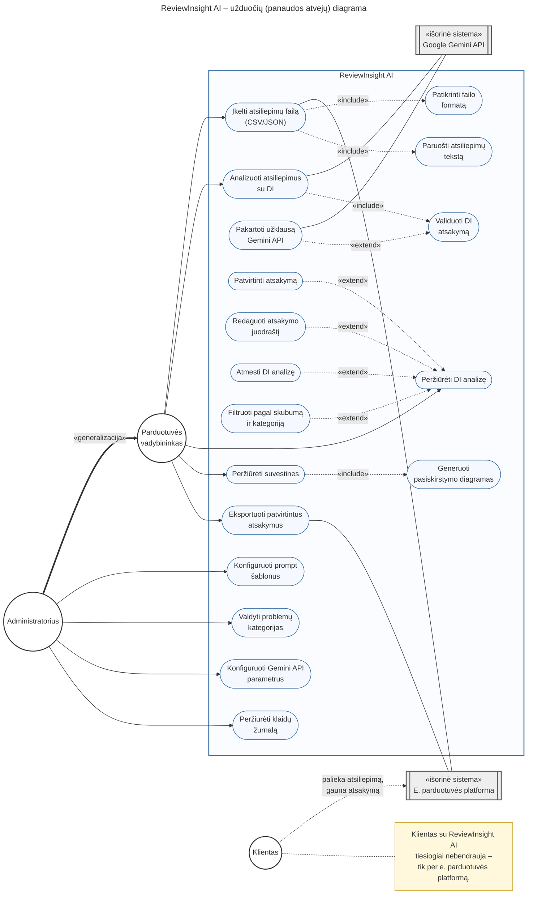

**Pokyčiai lyginant su PlantUML:** Mermaid neturi generalizacijos rodyklės su tuščiavidure trikampe galvute, todėl Administratorius → Vadybininkas pavaizduota stora rodykle su užrašu «generalizacija». PlantUML pastaba (note) pakeista geltonu mazgu, sujungtu punktyrine linija, o aktoriai rodomi apskritimais vietoj žmogeliukų.

### 2. Komponentų (architektūros) diagrama

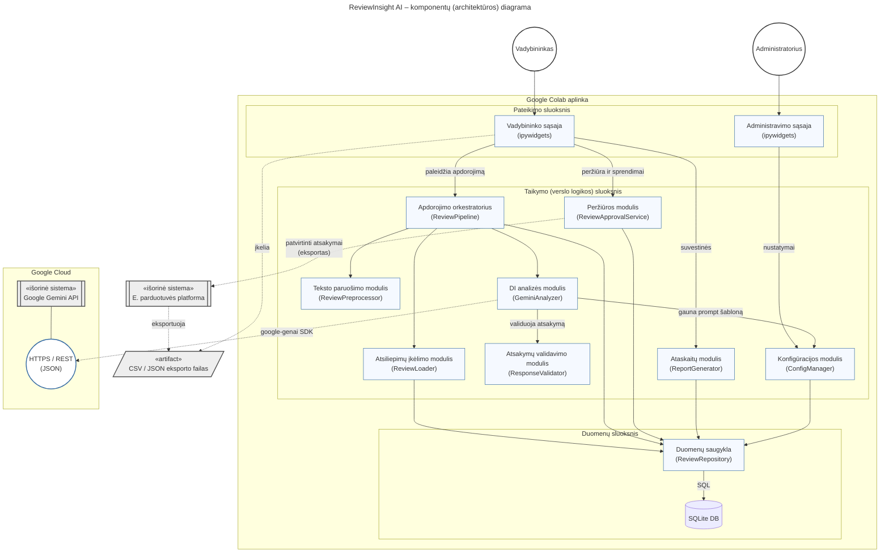

**Pokyčiai lyginant su PlantUML:** UML komponento ženkliukas ir sąsajos „ledinuko“ (lollipop) notacija neturi atitikmenų. Komponentai rodomi stačiakampiais, sąsaja apskritimu, artefaktas lygiagretainiu, o node ir cloud elementai virto subgraph blokais. Sluoksnių struktūra, visi moduliai ir ryšiai liko tokie patys.

### 3. Klasių diagrama

```mermaid
---
title: ReviewInsight AI – klasių diagrama
---
classDiagram
namespace Domeno_modelis {
class ReviewStatus {
<<enumeration>>
NEW
PREPROCESSED
REJECTED
ANALYZED
ANALYSIS_FAILED
APPROVED
DISMISSED
}
class Sentiment {
<<enumeration>>
POSITIVE
NEUTRAL
NEGATIVE
MIXED
}
class UrgencyLevel {
<<enumeration>>
LOW
MEDIUM
HIGH
CRITICAL
}
class DecisionType {
<<enumeration>>
APPROVED
EDITED
REJECTED
}
class Review {
-id: int
-product_id: str
-text: str
-clean_text: str
-rating: int
-created_at: datetime
-language: str
-status: ReviewStatus
+is_valid(min_length: int) bool
+mark_rejected(reason: str) None
+to_dict() dict
}
class AnalysisResult {
-id: int
-review_id: int
-sentiment: Sentiment
-confidence: float
-categories: List~str~
-summary: str
-urgency: UrgencyLevel
-reply_draft: str
-model_name: str
-prompt_version: int
-attempts: int
-created_at: datetime
+from_json(data: dict) AnalysisResult$
+to_dict() dict
+needs_attention() bool
}
class ManagerDecision {
-id: int
-analysis_id: int
-decision: DecisionType
-final_reply: str
-manager_name: str
-comment: str
-decided_at: datetime
}
class Category {
-id: int
-name: str
-description: str
-is_active: bool
}
class PromptTemplate {
-id: int
-version: int
-template_text: str
-is_active: bool
+render(review: Review, categories: List~str~) str
}
}
namespace Apdorojimo_logika {
class ReviewPipeline {
-loader: ReviewLoader
-preprocessor: ReviewPreprocessor
-analyzer: GeminiAnalyzer
-repository: ReviewRepository
+run(file_path: str) dict
}
class ReviewLoader {
-required_columns: List~str~
+load_file(file_path: str) DataFrame
-parse_csv(file_path: str) DataFrame
-parse_json(file_path: str) DataFrame
-validate_columns(df: DataFrame) bool
+to_reviews(df: DataFrame) List~Review~
}
class ReviewPreprocessor {
-min_length: int
-supported_languages: List~str~
+process(reviews: List~Review~) List~Review~
+clean_text(text: str) str
+detect_language(text: str) str
+is_too_short(text: str) bool
}
class GeminiAnalyzer {
-client: genai.Client
-model_name: str
-temperature: float
-max_retries: int
-validator: ResponseValidator
-config: ConfigManager
+analyze(review: Review) AnalysisResult
-build_prompt(review: Review) str
-call_api(prompt: str) str
-backoff(attempt: int) None
}
class ResponseValidator {
-schema: dict
-allowed_categories: List~str~
-errors: List~str~
+validate(raw_json: str) bool
+parse(raw_json: str) dict
+get_errors() List~str~
}
class ReviewApprovalService {
-repository: ReviewRepository
+get_pending(sort_by: str) List~AnalysisResult~
+approve(analysis_id: int) ManagerDecision
+edit(analysis_id: int, new_text: str) ManagerDecision
+reject(analysis_id: int, reason: str) ManagerDecision
+export_approved(file_path: str) None
}
class ReportGenerator {
-repository: ReviewRepository
+sentiment_distribution() DataFrame
+category_distribution() DataFrame
+plot_sentiment() Figure
+plot_categories() Figure
+export_report(file_path: str) None
}
class ConfigManager {
-repository: ReviewRepository
+get_active_prompt() PromptTemplate
+update_prompt(text: str) PromptTemplate
+get_categories() List~Category~
+add_category(name: str, description: str) Category
}
class AnalysisError {
-review_id: int
-attempts: int
-last_error: str
}
}
namespace Duomenu_prieiga {
class ReviewRepository {
-db_path: str
-connection: Connection
+save_reviews(reviews: List~Review~) None
+update_status(review_id: int, status: ReviewStatus) None
+save_analysis(result: AnalysisResult) int
+save_decision(decision: ManagerDecision) int
+get_pending_reviews() List~AnalysisResult~
+get_statistics() DataFrame
}
}
Review "1" *-- "0..1" AnalysisResult : turi
AnalysisResult "1" *-- "0..1" ManagerDecision : peržiūrima
AnalysisResult "*" --> "1..*" Category : priskiriama
AnalysisResult --> PromptTemplate : sukurta pagal
ReviewPipeline o-- ReviewLoader
ReviewPipeline o-- ReviewPreprocessor
ReviewPipeline o-- GeminiAnalyzer
ReviewPipeline o-- ReviewRepository
GeminiAnalyzer --> ResponseValidator : naudoja
GeminiAnalyzer --> ConfigManager : gauna šabloną
ConfigManager "1" --> "*" PromptTemplate : valdo
ConfigManager "1" --> "*" Category : valdo
ReviewLoader ..> Review : «create»
ReviewPreprocessor ..> Review : apdoroja
GeminiAnalyzer ..> AnalysisResult : «create»
GeminiAnalyzer ..> AnalysisError : «throw»
ReviewApprovalService ..> ManagerDecision : «create»
ReviewApprovalService --> ReviewRepository
ReportGenerator --> ReviewRepository
ConfigManager --> ReviewRepository
```

**Pokyčiai lyginant su PlantUML:** Paketai virto Mermaid namespace blokais. Jų pavadinimai negali turėti tarpų ir lietuviškų raidžių, todėl rašoma Domeno_modelis, Apdorojimo_logika, Duomenu_prieiga. Generiniai tipai užrašyti Mermaid sintakse List~str~, kuri atvaizduojama kaip `List<str>`. Statinis metodas pažymėtas $ (pabrauktas šriftas), o visi atributai, metodai, matomumas, ryšių tipai ir kardinalumai išlaikyti.

### 4. Sekų diagrama

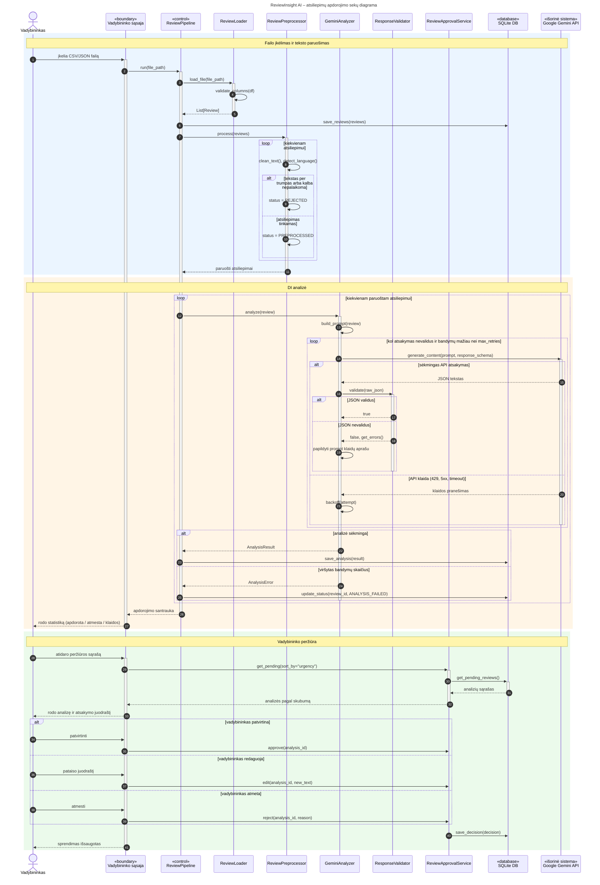

**Pokyčiai lyginant su PlantUML:** PlantUML fazių skirtukai `(== ... ==)` pakeisti spalvotais rect blokais su pastabomis, o dalyvių tipai (boundary, control, database) rodomi stereotipais pavadinimuose, nes Mermaid tokių formų neturi. Aktyvacijos juostos PlantUML versijoje nebuvo nurodytos, bet čia pridėtos pagal jūsų prašymą. `<` simbolis ciklo sąlygoje pakeistas žodžiais „mažiau nei“, kad sintaksė nesulūžtų.

### 5. Veiklos diagrama

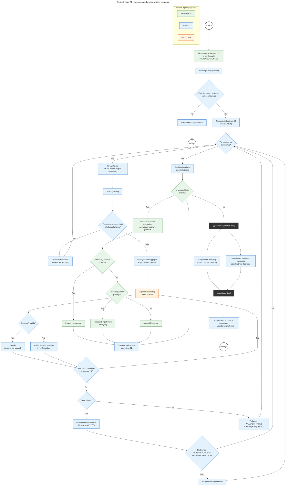

**Pokyčiai lyginant su PlantUML:** Mermaid flowchart nepalaiko takelių (swimlanes), todėl atsakomybės pažymėtos spalvomis su legenda. fork/join sinchronizacijos juostos pakeistos tamsiais mazgais, o repeat while ciklas pavaizduotas grįžtamąja rodykle nuo D5 į A9. Simbolis `<` užrašytas Mermaid esybės kodu `#lt;`, kad jis nebūtų interpretuojamas kaip HTML.

---

[← Grįžti į projekto aprašymą](../README.md)
