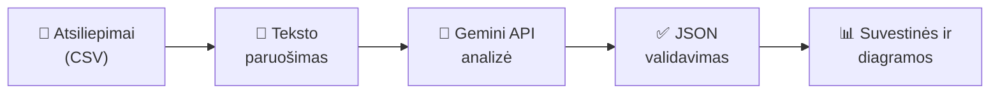

# 🛒 ReviewInsight AI

**Klientų atsiliepimų analizės sistema e. parduotuvei, naudojanti generatyvųjį dirbtinį intelektą (Google Gemini API).**

**Autoriai:** Rūta Stunžėnaitė, Justas Antanaitis (DIEf-24)
**Dalykas:** Gilusis mokymas naudojant TensorFlow · **Darbas:** 1 laboratorinis darbas

[](https://colab.research.google.com/github/ruta-stunzenaite/ReviewInsight-AI/blob/main/1.2.2_Colab_prototipas/ReviewInsight_AI_Gemini.ipynb)

---

## Apie projektą

E. parduotuvė kasdien gauna daug klientų atsiliepimų, o juos perskaityti ir į juos atsakyti rankiniu būdu užtrunka. **ReviewInsight AI** kiekvieną atsiliepimą automatiškai analizuoja su Gemini ir nustato:

- **nuotaiką** – teigiama, neutrali, neigiama ar mišri;
- **problemų kategorijas** – produkto kokybė, pristatymas, kaina, saugumas ir kt.;
- **skubumą** – nuo `low` iki `critical` (pvz., saugumo rizika visada gauna aukščiausią prioritetą);
- **santrauką** lietuvių kalba;
- **atsakymo klientui juodraštį** kliento kalba.



---

## Darbo dalys

| Dalis | Aplankas | Turinys |
|---|---|---|
| **1.1** | [`1.1_UML_diagramos/`](1.1_UML_diagramos/) | Sistemos projektavimas su ChatGPT: prompt'ai, 5 PlantUML diagramos (užduočių, komponentų, klasių, sekų, veiklos) ir jų Mermaid versijos |
| **1.2.1** | [`1.2.1_E2E_pavyzdziai/`](1.2.1_E2E_pavyzdziai/) | 6 end-to-end pavyzdžiai: (X, y) poros [`data/`](1.2.1_E2E_pavyzdziai/data/) aplanke ir testavimo prompt'as GPT agentui [`prompts/`](1.2.1_E2E_pavyzdziai/prompts/) aplanke |
| **1.2.2** | [`1.2.2_Colab_prototipas/`](1.2.2_Colab_prototipas/) | Veikiantis prototipas Google Colab aplinkoje su Gemini API: [`ReviewInsight_AI_Gemini.ipynb`](1.2.2_Colab_prototipas/ReviewInsight_AI_Gemini.ipynb) |

Kiekviename aplanke yra atskiras `README.md` su išsamesniu aprašymu.

---

## Repozitorijos struktūra

```
ReviewInsight-AI/
├── README.md                          ← šis failas
│
├── 1.1_UML_diagramos/                 ← 1.1 dalis
│   ├── README.md                      prompt'ai, PlantUML ir Mermaid diagramos
│   └── images/                        PlantUML diagramų paveikslėliai
│
├── 1.2.1_E2E_pavyzdziai/              ← 1.2.1 dalis
│   ├── README.md
│   ├── data/
│   │   ├── X/                         įvestys – kliento atsiliepimai
│   │   └── y/                         laukiami sistemos rezultatai
│   └── prompts/
│       ├── test_prompt.md             testavimo prompt'as GPT agentui
│       └── test_prompt_response.md    GPT atsakymas ir palyginimas
│
└── 1.2.2_Colab_prototipas/            ← 1.2.2 dalis
    ├── README.md                      paleidimo instrukcija
    ├── ReviewInsight_AI_Gemini.ipynb  Colab užrašinė
    └── input_data/                    užrašinės įvesties duomenys
```

---

## Technologijos

| Sritis | Įrankiai |
|---|---|
| Generatyvusis DI | Google Gemini API (`google-genai`) |
| Duomenų apdorojimas | Python, pandas, langdetect |
| Duomenų saugojimas | SQLite |
| Vizualizacija | matplotlib |
| Aplinka | Google Colab |
| Projektavimas | ChatGPT, PlantUML, Mermaid |

---

## Greitas paleidimas

1. Spauskite **Open in Colab** ženkliuką viršuje.
2. Colab 🔑 **Secrets** skiltyje pridėkite `GOOGLE_API_KEY` su savo [Gemini API raktu](https://aistudio.google.com/apikey).
3. **Runtime → Run all**.

Išsamesnė instrukcija: [`1.2.2_Colab_prototipas/README.md`](1.2.2_Colab_prototipas/README.md).
